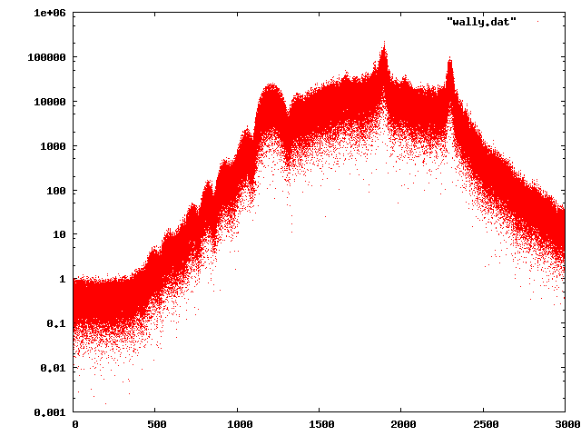

# sstv-encoders

A collection of programs that can encode JPEG images into WAV files
using various popular SSTV encodings.

To use these programs you'll need `libsndfile`, `libjpeg` and `libfftw3`
(only for `bw`).  You may need to modify `Makefile` to point to these
libraries if they are installed in unusual locations.

* `bw` *input.wav*
* `martin` *input.jpg output.wav*
* `pd180` *input.jpg output.wav*
* `robot36` *input.jpg output.wav*
* `robot72` *input.jpg output.wav*
* `scotty` *input.jpg output.wav*

All the programs except for `bw` write out 11025 samples/second WAV files.
They all include a header and trailer of 0.5 seconds of silence.

The `bw` file program reads in a wav file, and uses the fftw3 library to 
compute the power spectrum of the signal, and writes a series of 
frequency/power pairs out to standard out.  If you feed those into
a program like gnuplot, you can create plots like this (the power is plotted
with a logarithmic scale here).  

